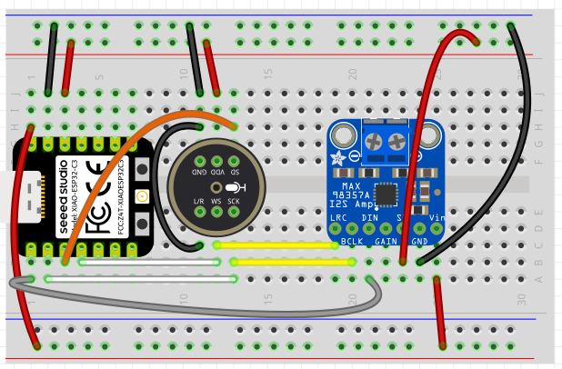

# XIAO ESP32-C6 Eye Servo Breakout

This board profile runs the eye/eyelid servos as MCP-controlled tools on a Seeed
XIAO ESP32-C6. Servos are driven by a PCA9685 16-channel I2C PWM board (Adafruit
product 815), so they cost only two XIAO pins (SDA/SCL). That leaves the I2S pins
free, so this board keeps the normal INMP441 mic + MAX98357A speaker alongside
the servos.

## Board Profile

Build target:

```bash
./switch-board.sh xiao-esp32-c6-eyes build
```

Flash target:

```bash
./switch-board.sh xiao-esp32-c6-eyes flash
```

The board implementation lives in:

```text
main/boards/xiao-esp32-c6-eyes/
```

## Wiring

### Base breadboard layout (reference)



This is the base breadboard layout used across the boards so far (XIAO + INMP441
mic + MAX98357A amp). This board keeps that audio wiring and adds the PCA9685
servo board on the I2C bus. A servo-specific diagram will be added.

### Audio (unchanged from the base XIAO C6 board)

| Signal | XIAO pad | ESP32-C6 GPIO |
| --- | --- | --- |
| DOUT (speaker) | D0 | GPIO0 |
| BCLK | D1 | GPIO1 |
| WS / LRC | D2 | GPIO2 |
| DIN (mic) | D3 | GPIO21 |

### PCA9685 servo board

The XIAO talks to the PCA9685 over I2C using its default SDA/SCL pads:

| Signal | XIAO pad | ESP32-C6 GPIO | PCA9685 pin |
| --- | --- | --- | --- |
| SDA | D4 | GPIO22 | SDA |
| SCL | D5 | GPIO23 | SCL |
| 3V3 logic | 3V3 | — | VCC |
| Ground | GND | — | GND |

Servos plug into the PCA9685 channel headers (default I2C address `0x40`):

| Servo | PCA9685 channel |
| --- | --- |
| Left eye | 0 |
| Right eye | 1 |
| Left eyelid | 2 |
| Right eyelid | 3 |

Power the servos from a separate 5V supply into the PCA9685 **V+** terminal. Do
not power them from the XIAO 3V3 or USB 5V pin. Tie the 5V supply ground, the
PCA9685 ground, and the XIAO ground together.

Recommended additions:

- 470 uF to 1000 uF capacitor across the PCA9685 V+ and ground.
- Start with one servo connected, mechanically disconnected from the eye linkage.
- Confirm MCP movement before connecting the remaining servos.

## MCP Tools

The board registers these MCP tools:

- `self.eyes.set_position`
- `self.eyes.center`
- `self.eyes.get_position`
- `self.eyelids.set_position`
- `self.eyelids.open`
- `self.eyelids.close`
- `self.eyes.set_trim`

Angles are currently accepted from 0 to 180 degrees. After the physical eye
mechanism is measured, add per-servo min/max limits so commands cannot drive
the linkage into a hard stop.
